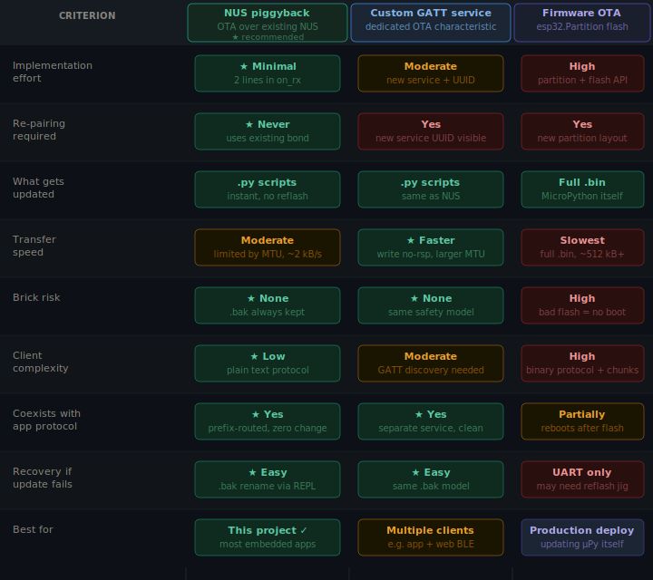

# OTA approaches — overview and comparison

Three approaches exist for doing OTA updates on ESP32 MicroPython over BLE.
This project implements **approach 1** (NUS piggyback). The comparison below
explains why, and when you might prefer one of the others.



---

## Approach 1 — NUS piggyback ★ (this project)

OTA traffic rides alongside your existing Nordic UART Service (NUS) connection.
Messages are newline-terminated ASCII lines prefixed with `OTA:`, routed in
your existing `on_rx` handler:

```python
def _on_rx(self, data):
    line = data.decode('utf-8', 'ignore').strip()
    if line.startswith("OTA:"):
        self.ota.handle(line)   # ← new
    else:
        self._app_handle(line)  # ← unchanged
```

**Pros:** Zero re-pairing, minimal code change, no new GATT service, easy
client, safe recovery via `.bak`, no brick risk.

**Cons:** Slightly lower raw throughput than a dedicated characteristic (both
share the same MTU-limited NUS TX/RX pipe); protocol is text so 2× overhead
from hex-encoding.

**Best for:** Any application already using NUS for its normal comms.

---

## Approach 2 — Custom GATT OTA service

A new BLE service with dedicated characteristics:

```
OTA Service (custom UUID)
  ├── Control  (Write)       ← START / COMMIT / ABORT commands
  ├── Data     (Write no-rsp)← raw binary chunks, no text framing
  ├── Status   (Notify)      ← progress / ACK / ERROR
  └── CRC      (Write/Read)  ← integrity check
```

**Pros:** Cleaner separation of concerns; binary data transfer (no hex
overhead, ~2× faster); dedicated MTU negotiation per characteristic; client
can discover OTA capability from the GATT profile alone.

**Cons:** Client must perform full GATT service discovery before use; device
must advertise a new service UUID, which requires re-pairing on some platforms;
more firmware code to maintain.

**Best for:** Devices with multiple distinct clients (mobile app + web BLE +
desktop CLI) where a self-describing GATT profile is valuable.

---

## Approach 3 — Full firmware OTA (esp32.Partition)

Uses the ESP32's native dual-partition OTA mechanism to flash a complete
new MicroPython `.bin` over BLE.

```python
import esp32
nxt = esp32.Partition(esp32.Partition.RUNNING).get_next_update()
# stream binary chunks from BLE → nxt.writeblocks(block_num, chunk)
nxt.set_boot()
machine.reset()
```

**Pros:** Updates MicroPython itself, not just your scripts; standard
ESP-IDF OTA model with hardware rollback support.

**Cons:** High brick risk — a bad flash or interrupted transfer leaves
the device unbootable without a UART recovery jig; very slow (512+ kB
transfer over BLE at ~2 kB/s = 4+ minutes); requires custom partition
table; dramatically more complex client; reboots terminate the BLE session
immediately, so `OTA:OK` may never reach the client.

**Best for:** Production field deployments where updating the MicroPython
interpreter itself is a requirement (e.g. security patches to the VM layer).
Should be combined with a hardware watchdog and a verified-boot scheme.
