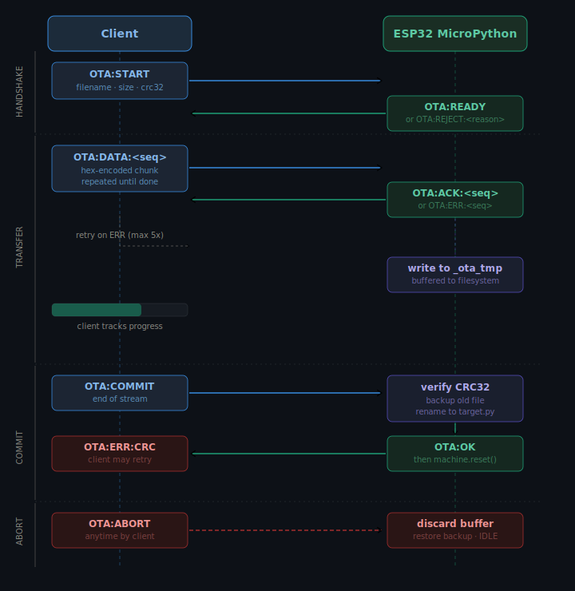
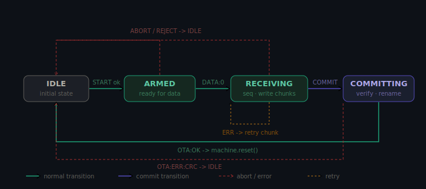

# OTA Protocol Reference



All messages are newline-terminated UTF-8 strings over the standard NUS RX/TX characteristics.

## State machine



| State | Entered when | Exits when |
|---|---|---|
| `IDLE` | startup / after reset | valid `OTA:START` received |
| `ARMED` | `OTA:START` accepted | first `OTA:DATA` received |
| `RECEIVING` | first `OTA:DATA` accepted | `OTA:COMMIT` or `OTA:ABORT` |
| `COMMITTING` | `OTA:COMMIT` received | CRC verified or error |

## Commands

### OTA:START

```
OTA:START:<filename>:<size>:<crc32>[:<version>[:<chunk_size>[:<token>]]]
```

Replies: `OTA:READY` or `OTA:REJECT:<FORBIDDEN|NOSPACE|AUTH|VERSION|BUSY|BAD_ARGS>`

### OTA:DATA

```
OTA:DATA:<seq>:<hex_payload>
```

Replies: `OTA:ACK:<seq>` or `OTA:ERR:<seq>`

### OTA:COMMIT

```
OTA:COMMIT
```

Replies: `OTA:OK` or `OTA:ERR:<SIZE|CRC|RENAME>:...`

### OTA:ABORT

```
OTA:ABORT
```

Reply: `OTA:ABORTED`

## CRC32

Both sides use the ISO 3309 polynomial — identical to Python `binascii.crc32()`.

## Example session

```
→  OTA:START:main.py:312:a3f1c820:1.2.0:88
←  OTA:READY
→  OTA:DATA:0:7072696e...
←  OTA:ACK:0
   ...
→  OTA:COMMIT
←  OTA:OK
    [device resets]
```
